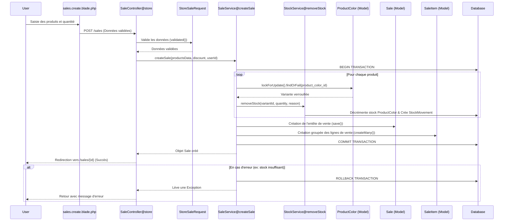

# Flux de Création d'une Vente

Ce document détaille le processus technique de création d'une vente au sein de l'application, de l'interface utilisateur jusqu'à la persistance en base de données.

## 1. Interface Utilisateur (`sales.create.blade.php`)

- L'utilisateur sélectionne les produits (variantes couleur/stock) via un formulaire dynamique.
- Les données envoyées incluent un tableau `products` contenant `product_color_id` et `quantity`, ainsi qu'un champ optionnel `discount`.

## 2. Validation (`StoreSaleRequest.php`)

Le système valide les données entrantes avant d'atteindre le contrôleur :

- `products` : Tableau requis avec au moins un élément.
- `products.*.product_color_id` : Doit exister dans la table `product_colors` et être unique dans la requête (`distinct`).
- `products.*.quantity` : Entier positif (minimum 1).
- `discount` : Numérique, minimum 0.

## 3. Orchestration (`SaleController@store`)

Le contrôleur agit comme un chef d'orchestre :

1. Récupère les données validées.
2. Appelle `SaleService->createSale()`.
3. Gère les exceptions (ex: stock insuffisant) via un bloc `try-catch` pour renvoyer un message d'erreur utilisateur (`with('error', ...)`).
4. Redirige vers la vue détaillée de la vente en cas de succès.

## 4. Logique Métier (`SaleService@createSale`)

C'est le cœur critique du système. Toutes les opérations sont encapsulées dans une **Transaction SQL** (`DB::transaction`).

### Étape A : Initialisation

- Génération d'une référence unique (`SALE-XXXXXXXX`).
- Identification de l'auteur de la vente (`user_id`).

### Étape B : Traitement des produits (Boucle)

Pour chaque produit dans la commande :

1. **Verrouillage Pessimiste** : Utilisation de `lockForUpdate()` sur la ligne `ProductColor`. Cela empêche d'autres transactions de modifier le stock de ce produit précis tant que la vente n'est pas terminée (évite les _race conditions_).
2. **Vérification de disponibilité** : Si `stock < quantity`, une `Exception` est levée, provoquant un rollback automatique de toute la transaction.
3. **Calcul des sous-totaux** : Basé sur le prix réel en base de données (sécurité contre la manipulation de prix côté client).
4. **Mise à jour du Stock** : Appel à `StockService->removeStock()` qui :
    - Décrémente le stock physique.
    - Enregistre un mouvement de stock (`StockMovement`) de type `out` pour l'audit.

### Étape C : Finalisation

1. **Calcul des totaux** : Somme des lignes moins la remise (avec sécurité `max(0, ...)`).
2. **Persistance `Sale`** : Sauvegarde de l'en-tête de la vente.
3. **Insertion groupée `SaleItem`** : Utilisation de `createMany()` pour insérer toutes les lignes en une seule requête SQL (optimisation de performance).

## 5. Points Clés de l'Architecture

| Caractéristique | Implémentation    | Bénéfice                                                                              |
| :-------------- | :---------------- | :------------------------------------------------------------------------------------ |
| **Intégrité**   | `DB::transaction` | Pas de vente créée sans décrémentation de stock, et inversement.                      |
| **Concurrence** | `lockForUpdate()` | Prévient la survente si deux vendeurs vendent le dernier article en même temps.       |
| **Traçabilité** | `StockService`    | Chaque vente génère un historique précis dans `stock_movements`.                      |
| **Performance** | `createMany()`    | Réduit la charge sur la base de données lors de grosses factures.                     |
| **Isolation**   | `SaleService`     | La logique de vente est réutilisable (API, Import, etc.) sans modifier le contrôleur. |

## 6. Diagramme de Séquence (Mermaid)

---

_Dernière mise à jour : Mai 2026_
